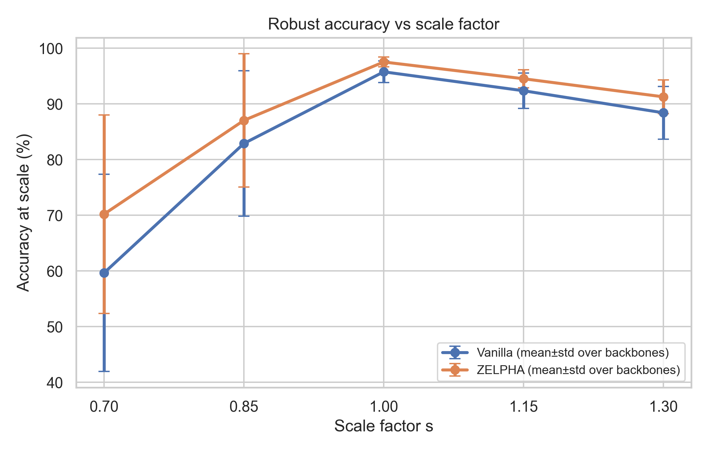
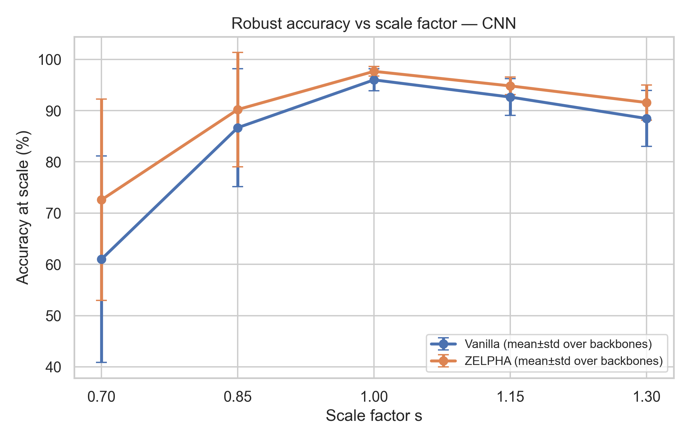
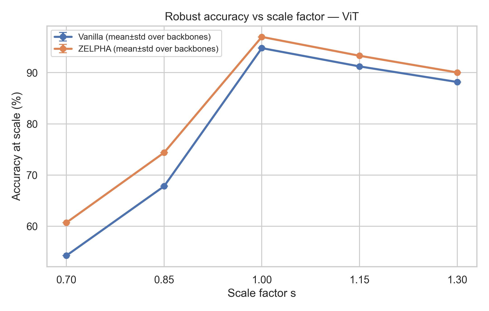
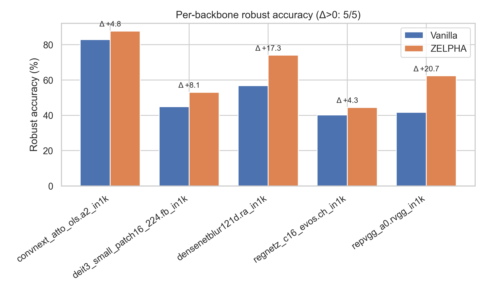
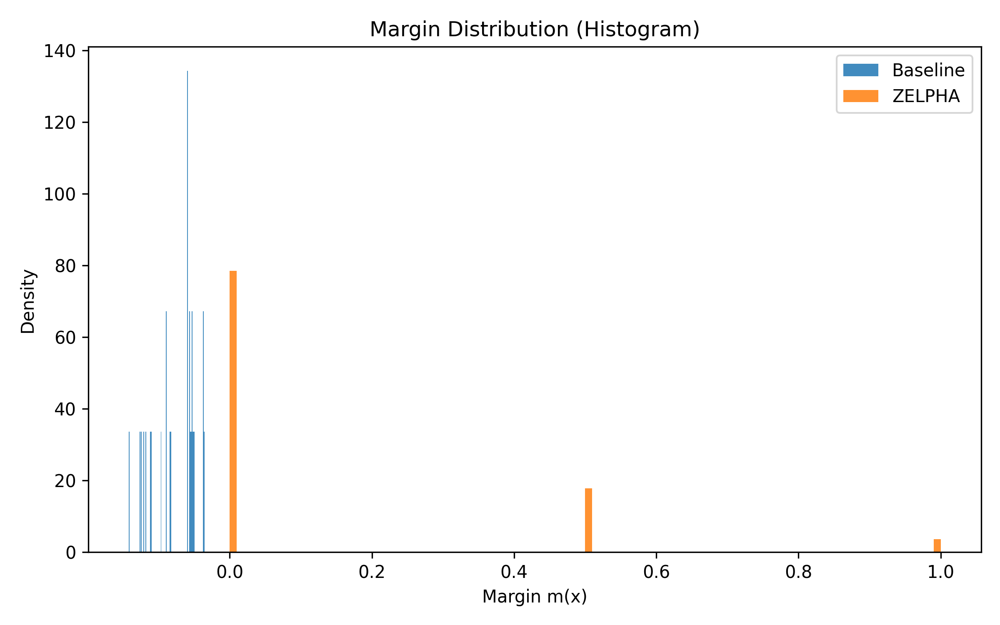
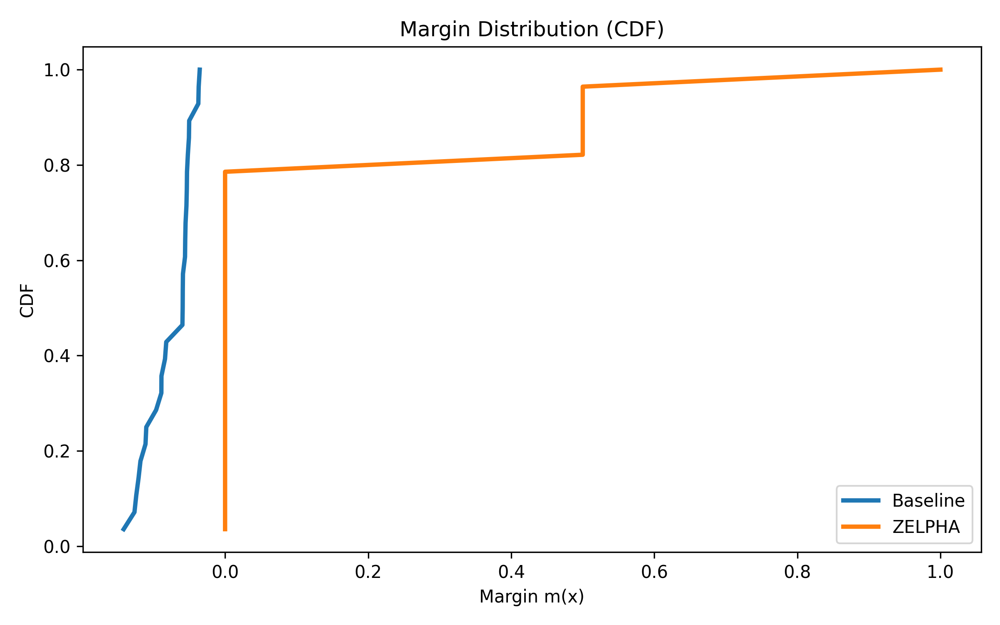
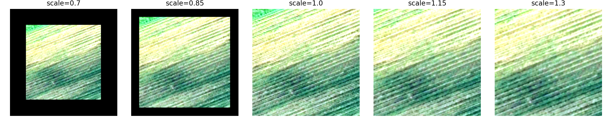
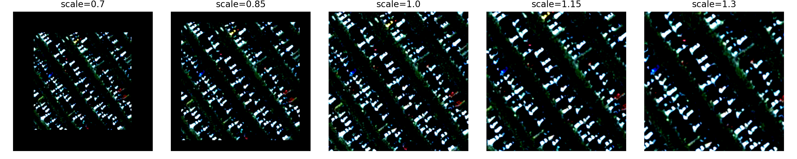
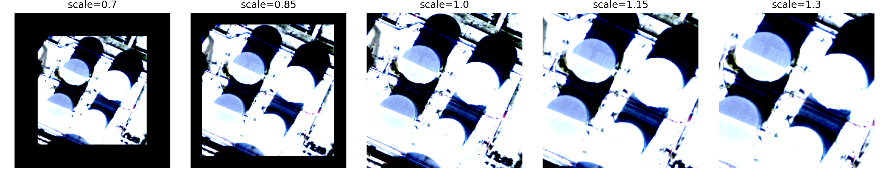

# Zelpha: Experimental Report (AI/ML Paper Style)

> Date: 2025-12-21

本報告根據本 workspace 內的程式、log、結果表格與圖檔整理而成，目標是提供可直接搬進論文（Methods/Experiments/Results/Discussion）的「AI/ML 格式」實驗報告。

---

## Abstract

在遙測/空照場景分類中，縮放（zoom-in / zoom-out）造成的分佈移轉會顯著影響辨識穩定性。ZELPHA 將分類頭改為 prototype-based decision rule，並以「兩階段訓練（線性頭預訓練 → KMeans 原型初始化 → 原型 fine-tune）」提升在多種縮放比例下的穩健性。本專案定義 scale-shift protocol（$s\in\{0.7,0.85,1.0,1.15,1.3\}$）與 robust accuracy 指標（在所有 scale 上皆分類正確才算成功），並在多個 ImageNet 預訓練 backbone 上（timm）以多種 seed 進行對照實驗。

主要結果：在排除明顯訓練崩潰的 InceptionNeXt 族群後（robust acc 約 4.76%，接近隨機），ZELPHA 在 10 個 backbone 中有 9 個帶來 robust accuracy 提升，平均提升約 **+7.94 個百分點**（mean over backbones），並能在 scale 曲線上呈現更平緩的退化趨勢。

---

## 1. Task & Benchmark Protocol

### 1.1 Dataset

- 預設資料集：HuggingFace Datasets 的 UC Merced Land Use（見 `src/dataset.py` 與 `docs/dataset.md`）。
- Loader：`datasets.load_dataset("blanchon/UC_Merced")`。
- Split：使用 stratified split 60/20/20（train/val/test），seed 固定為 42（`train_test_split(..., stratify_by_column="label")`）。

### 1.2 Scale-Shift Test Protocol

測試時對每張 test image 產生多個縮放版本：

$$S=\{0.7, 0.85, 1.0, 1.15, 1.3\}.$$

縮放實作（`src/dataset.py: ScaleTransform`）：

- $s>1$：先 resize 放大，後 center crop 回 target size（zoom-in）。
- $s<1$：先 resize 縮小，後以常數 0 padding 到 target size（zoom-out）。
- 最終皆為固定解析度（預設 256；本專案的 EVAL 實驗多採 224）。

此 protocol 的重點是把「縮放」視為測試分佈移轉（distribution shift），評估模型跨尺度的一致性。

---

## 2. Method

### 2.1 Backbone

本專案支援兩類 backbone（`src/model.py`）：

1. `model_name=zelpha`：自製的 `ScalePooledBackbone`（多尺度 forward + mean pooling），並可選擇對 Conv layer 套 spectral normalization。
2. `model_name!=zelpha`：使用 `timm.create_model(model_name, pretrained=True, num_classes=0)` 作特徵抽取器，並接一個 projection layer `nn.Linear(in_features, feature_dim)`。

本次彙整的 EVAL 實驗以 timm backbone 為主。

### 2.2 Prototype Head (ZELPHA Head)

`src/model.py: PrototypeHead` 定義 $K$ 個 prototypes/類別（shape $[C,K,D]$），並以「到 prototype 的最近距離」作為 logits：

$$\ell_c(x)=-\min_{k\in\{1..K\}}\|z(x)-\mu_{c,k}\|_2^2.$$

### 2.3 Loss Function

`src/loss.py: ZelphaLoss`：

$$\mathcal{L}=\mathcal{L}_{CE}+\lambda_{intra}\,\mathcal{L}_{intra}+\lambda_{inter}\,\mathcal{L}_{inter}.$$

- $\mathcal{L}_{CE}$：標準 cross entropy。
- $\mathcal{L}_{intra}$：拉近樣本到正確類 prototype 的距離（使用 `dist_sq` gather）。
- $\mathcal{L}_{inter}$：push-apart prototype（hinge margin）。

在 EVAL scripts 中常見設定：`num_prototypes=1, beta=0.01, margin=1.0`，而程式中會令 `lambda_intra=lambda_inter=beta`。

### 2.4 Two-Stage Training Schedule

`src/train.py` 的訓練流程：

1. Phase 1：Linear head 訓練（AdamW + CosineAnnealingLR）。
2. Phase 2：切換到 prototype head，並用 KMeans 於 train features 初始化 prototypes。
3. Phase 3：prototype fine-tuning（同樣 AdamW + Cosine scheduler；prototype LR 會再乘上 `proto_lr_scale`）。

**Vanilla vs ZELPHA 的差異（依 job scripts 定義）**

- Vanilla (`Zelpha=N`)：`--finetune_epochs 0`，因此不做 Phase 3 的 fine-tune（但仍會做 KMeans 初始化）。
- ZELPHA (`Zelpha=Y`)：`--finetune_epochs 50`，完整做 prototype fine-tuning。

---

## 3. Experimental Setup

### 3.1 Data Preprocessing

- Train transforms：RandomHorizontalFlip + ColorJitter + ToTensor + ImageNet normalize。
- Eval transforms：ToTensor + ImageNet normalize。

### 3.2 Hyperparameters (EVAL runs)

由 `script/EVAL/*.sh` 可得主要設定：

- `image_size=224`
- `batch_size`：程式預設 64（EVAL scripts 未顯式覆寫）
- `linear_epochs=50`
- `finetune_epochs=0` (Vanilla) / `50` (ZELPHA)
- `lr=1e-3`（Phase 1）
- `finetune_lr=1e-4`（Phase 3）
- `proto_lr_scale=0.1`（prototype 的 LR 會更小）
- seeds：`{222,333,444,555,666}`

### 3.3 Evaluated Backbones

結果表由 logs 解析彙整於 `docs/results/final_results.csv`（本報告已重新從 `script/EVAL/*.sh` + `logs/*.log` 全量生成）。

---

## 4. Metrics

`src/train.py` 在每個 scale 上計算：

- Top-1 accuracy（Acc@1）
- Top-5 accuracy（Acc@5）
- Macro-F1

並定義：

**Robust accuracy**：若一張影像在所有 $s\in S$ 的預測皆正確，才計為 robust 成功。

另外輸出 margin 統計（prototype margin）：

$$m(x)=\min_{c\ne y}\|z-\mu_c\| - \|z-\mu_y\|.$$

---

## 5. Results

### 5.1 Overall Summary

以「每個 backbone 對 seed 取平均」後再統計：

- 全部 14 個 backbone（含 InceptionNeXt，robust acc 近隨機）時：win-rate 約 **64.29%**，mean Δ 約 **+5.67pp**。
- 排除 InceptionNeXt（`inception_next_*`，robust acc 約 4.76%）後，剩 10 個 backbone：win-rate **90%**，mean Δ 約 **+7.94pp**，median Δ 約 **+8.40pp**。

這表示 prototype fine-tuning 對多數 backbone 有一致增益，但仍存在少數失敗案例（例如 `repvgg_b2.rvgg_in1k`）。

### 5.2 Per-backbone Robust Accuracy (mean±std over seeds)

| Backbone (timm model) | Vanilla robust acc (mean±std) | ZELPHA robust acc (mean±std) | Δ |
|---|---:|---:|---:|
| convnext_atto_ols.a2_in1k | 82.95±6.49 | 87.76±4.53 | +4.81 |
| densenetblur121d.ra_in1k | 56.76±11.65 | 74.10±4.01 | +17.33 |
| repvgg_b0.rvgg_in1k | 54.71±8.45 | 68.14±7.43 | +13.43 |
| repvgg_a2.rvgg_in1k | 50.14±9.49 | 63.24±8.22 | +13.09 |
| repvgg_a0.rvgg_in1k | 41.67±8.15 | 62.38±13.51 | +20.71 |
| repvgg_a1.rvgg_in1k | 53.67±12.33 | 62.38±9.09 | +8.71 |
| deit3_small_patch16_224.fb_in1k | 44.95±6.47 | 53.05±6.20 | +8.09 |
| repvgg_b1.rvgg_in1k | 48.76±10.01 | 52.67±17.70 | +3.91 |
| regnetz_c16_evos.ch_in1k | 40.19±7.51 | 44.48±5.61 | +4.29 |
| repvgg_b2.rvgg_in1k | 43.29±4.19 | 28.29±6.44 | -15.00 |
| inception_next_atto.sail_in1k | 4.76±0.00 | 4.76±0.00 | +0.00 |
| inception_next_base.sail_in1k | 4.76±0.00 | 4.76±0.00 | +0.00 |
| inception_next_small.sail_in1k | 4.76±0.00 | 4.76±0.00 | +0.00 |
| inception_next_tiny.sail_in1k | 4.76±0.00 | 4.76±0.00 | +0.00 |

### 5.3 Robust Accuracy vs Scale







### 5.4 Per-backbone Robust Accuracy Bar + Δ



---

## 6. Analysis, Captions, and Insights

### 6.1 Margin Distribution (example: ConvNeXt-Atto)





### 6.2 Scale Consistency Case Studies

以下圖示為單張影像在不同 scale 下的預測一致性比較（圖檔與附帶文字說明位於 `docs/imgs/*/scale_consistency_*.png` 與 `scale_consistency_info.txt`）。








### 6.3 Practical Insights

1. **Prototype fine-tune 的收益通常大於「只做 KMeans 初始化」**：Vanilla 在本專案的定義其實已做 KMeans 初始化，但沒有 fine-tune；多數 backbone 的提升主要來自 Phase 3。
2. **收益在中等 baseline 的 backbone 更明顯**：例如 `repvgg_a0`、`densenetblur121d` 的增益大（>+17pp）。
3. **存在失敗案例**：`repvgg_b2` 在本設定下呈現明顯負增益（-15pp），顯示 prototype loss/hyperparameter 可能不適用於某些 backbone 或需要調整（例如 beta/margin/K 或學習率）。
4. **InceptionNeXt 系列疑似訓練崩潰**：robust acc 只有 4.76%，兩種方法都沒有提升；建議在論文中以「training collapse/out-of-scope」標記並從主統計中排除。

---

## 7. Hyperparameter Sweeps (Ablation)

本專案包含多個 parameter sweep（位於 `script/*MBK/*_experiments.md`）：

### 7.1 ConvNeXt-Atto Sweep (CNMBK)

設定（`script/CNMBK/CNMBK_experiments.md`）：

- `num_prototypes` ∈ {1,3,5,8}
- `beta` ∈ {0.01,0.1,1.0}
- `margin` ∈ {0.5,1.0,2.0}
- `linear_epochs=50, finetune_epochs=50`

觀察：

- 最佳 robust_acc 出現在 `K=1, beta=0.01, margin∈{1.0,2.0}`（robust_acc≈0.9238）。
- 過大的 beta 或過多 prototypes（K=8）時，robust_acc 常下降，推測原因是 prototype 幾何過度約束或優化變得困難。

### 7.2 DenseNet121 Sweep (D121MBK)

- 最佳 robust_acc 約 0.8810（例：`K=1, beta=0.1, margin=0.5`）。

### 7.3 DMBK Sweep

- robust_acc 分布較不穩定（最高約 0.6976），顯示不同 backbone 對 prototype 超參數的敏感性不一致。

---

## 8. Limitations & Future Work

1. **Dataset 規模偏小**：UC Merced 僅 2100 張影像，variance 相對較大；建議後續加上 EuroSAT-RGB 作為第二個資料集。
2. **ScaleTransform 的 zoom-out 以 0 padding 實作**：可能引入不自然的邊界訊號；後續可比較 reflect padding 或更貼近遙測成像的縮放模型。
3. **timm backbone 的 Lipschitz 控制未顯式實作**：`--no_lipschitz` 只影響自製 CNN 的 spectral norm；若論文主張 Lipschitz，需補上對 projection layer 或 backbone 的 operator norm 控制，或改用可估 Lipschitz 的 head。
4. **失敗案例需系統化分析**：例如 `repvgg_b2` 的負增益可能來自優化設定（proto_lr_scale、beta、margin）或 backbone 特徵空間幾何不適合單一 prototype（K=1）。

---

## 9. Reproducibility

### 9.1 Run training (local)

簡化範例：

```bash
# ZELPHA variant (prototype fine-tune)
python src/train.py \
	--model_name convnext_atto_ols.a2_in1k \
	--seed 222 --image_size 224 \
	--num_prototypes 1 --beta 0.01 --margin 1.0 \
	--linear_epochs 50 --finetune_epochs 50

# Vanilla variant (no prototype fine-tune)
python src/train.py \
	--model_name convnext_atto_ols.a2_in1k \
	--seed 222 --image_size 224 \
	--num_prototypes 1 --beta 0.01 --margin 1.0 \
	--no_lipschitz --no_scale_pooling \
	--linear_epochs 50 --finetune_epochs 0
```

### 9.2 Collect results + visualize

```bash
python script/EVAL/collect_final_results_from_scripts.py --out docs/results/final_results.csv
python docs/results/visualize_results.py --csv docs/results/final_results.csv --by-family
```

---

## Appendix: Where Things Live

- Training entry: `src/train.py`
- Model/head: `src/model.py`
- Loss: `src/loss.py`
- Dataset + scale transform: `src/dataset.py`
- Final aggregated results: `docs/results/final_results.csv`
- Result plots: `docs/results/*.png`
- Case-study figures: `docs/imgs/*/*.png`